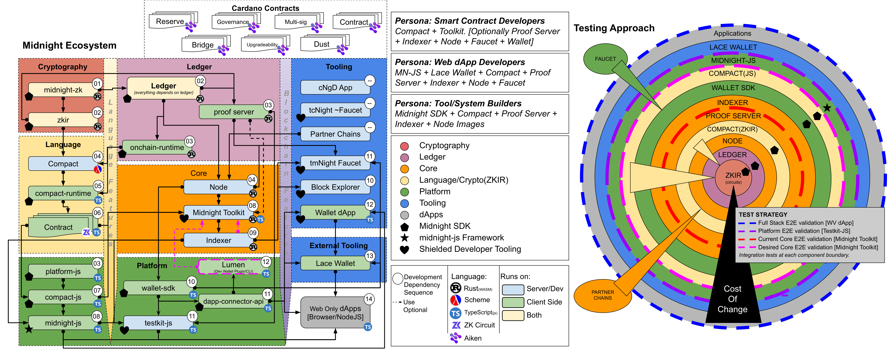

# Midnight Ecosystem

## Architecture Layers

The Midnight network is built in layers. Inner layers are harder to change and have the widest blast radius. Outer layers depend on inner ones.

### Cryptography

| Component | Repository | Description |
|---|---|---|
| midnight-zk | midnightntwrk/midnight-zk | ZK cryptography primitives |
| zkir | midnightntwrk/midnight-zk | ZK intermediate representation — circuit format consumed by the proof server |

### Ledger

Everything depends on the ledger. The ledger version is the compatibility anchor for the entire ecosystem.

| Component | Repository | Description |
|---|---|---|
| Ledger | [midnightntwrk/midnight-ledger](https://github.com/midnightntwrk/midnight-ledger) | Transaction validation, state management, WASM bindings |
| Proof Server | [midnightntwrk/midnight-ledger](https://github.com/midnightntwrk/midnight-ledger) | ZK proof generation and verification. Dual-role: shared infrastructure or run locally by DApp developers |
| On-chain Runtime | [midnightntwrk/midnight-ledger](https://github.com/midnightntwrk/midnight-ledger) | WASM runtime executed on-chain. npm: `@midnight-ntwrk/onchain-runtime-v3` |

### Core

| Component | Repository | Description |
|---|---|---|
| Node | [midnightntwrk/midnight-node](https://github.com/midnightntwrk/midnight-node) | Substrate-based blockchain node. Pins a specific ledger version. |
| Indexer | [midnightntwrk/midnight-indexer](https://github.com/midnightntwrk/midnight-indexer) | Indexes on-chain data for querying (GraphQL API) |
| Partner Chains | [input-output-hk/partner-chains](https://github.com/input-output-hk/partner-chains) | Cardano ↔ Midnight bridge infrastructure |

### Language

| Component | Repository | Description |
|---|---|---|
| Compact | [LFDT-Minokawa/compact](https://github.com/LFDT-Minokawa/compact) | Smart contract language and compiler (`compactc`) |
| compact-runtime | [LFDT-Minokawa/compact](https://github.com/LFDT-Minokawa/compact) | Runtime support for compiled Compact contracts. npm: `@midnight-ntwrk/compact-runtime` |
| Contract (compiled) | — | Output of `compactc`: JS executable (circuits) + TypeScript declarations |

### Platform

| Component | Repository | Description |
|---|---|---|
| platform-js | [midnightntwrk/midnight-sdk](https://github.com/midnightntwrk/midnight-sdk) (this repo) | Core abstractions and types used by compact-js, wallet-sdk, and midnight-js |
| compact-js | [midnightntwrk/midnight-sdk](https://github.com/midnightntwrk/midnight-sdk) (this repo) | TypeScript execution environment for compiled Compact contracts |
| wallet-sdk | [midnightntwrk/midnight-wallet](https://github.com/midnightntwrk/midnight-wallet) | Wallet operations. Also used by Node.js DApps as an integration layer |
| dapp-connector-api | [midnightntwrk/midnight-dapp-connector-api](https://github.com/midnightntwrk/midnight-dapp-connector-api) | Interface between DApps and wallets |
| midnight-js | [midnightntwrk/midnight-js](https://github.com/midnightntwrk/midnight-js) | DApp framework: contracts, types, providers |
| testkit-js | [midnightntwrk/midnight-js](https://github.com/midnightntwrk/midnight-js) | Contract testing and E2E test suite |

### Tooling

| Component | Repository | Description |
|---|---|---|
| Midnight Toolkit | [midnightntwrk/midnight-node](https://github.com/midnightntwrk/midnight-node) | CLI for deploying and interacting with contracts |
| Faucet (tNIGHT) | midnightntwrk/midnight-faucet | Test token distribution for testnets |
| Block Explorer | midnightntwrk/midnight-explorer | On-chain data browser |
| Wallet DApp | [midnightntwrk/midnight-wallet-dapp](https://github.com/midnightntwrk/midnight-wallet-dapp) | Reference DApp showing provider pattern and wallet integration |

### External Tooling

| Component | Description |
|---|---|
| Lace Wallet | Third-party browser wallet with Midnight support |
| Lumen | Developer wallet plugin/CLI (in development) |

### Cardano

| Component | Description |
|---|---|
| cNgD App | cNIGHT-generates-Dust registration application. Runs on Cardano networks. |
| Cardano Contracts | On-chain contracts supporting the Midnight ↔ Cardano bridge: Reserve, Governance, Multi-sig, Contract, Bridge, Upgradeability, Dust |

## Developer Personas

| Persona | Components |
|---|---|
| Smart Contract Developers | Compact + Toolkit. Optionally: Proof Server + Indexer + Node + Faucet + Wallet |
| Web DApp Developers | midnight-js + Lace Wallet + Compact + Proof Server + Indexer + Node + Faucet |
| Tool/System Builders | Midnight SDK + Compact + Proof Server + Indexer + Node Images |

## Dependency Flow

The numbered sequence in the diagram shows the development dependency order:

1. midnight-zk → 2. zkir, Ledger → 3. Proof Server, On-chain Runtime, platform-js → 4. Compact, Node → 5. compact-runtime → 6. Contract (compiled) → 7. compact-js → 8. midnight-js, Midnight Toolkit → 9. Indexer → 10. wallet-sdk, Block Explorer → 11. dapp-connector-api, testkit-js, tmNight Faucet → 12. Wallet DApp, Lace Wallet

## Runs On

| Environment | Components |
|---|---|
| Server / Infrastructure | Node, Indexer, Proof Server (shared), Faucet, Block Explorer |
| Client / Developer | Compact, compact-js, midnight-js, wallet-sdk, Toolkit, Proof Server (local), Lumen |
| Both | Proof Server, Wallet DApp |
